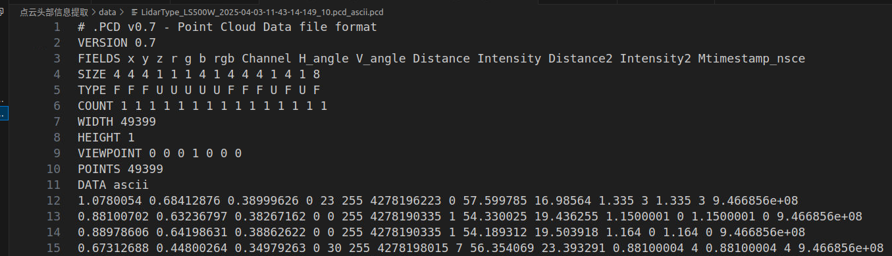
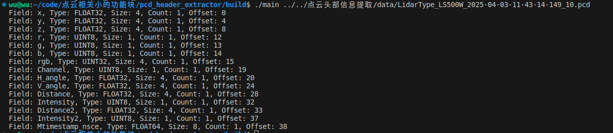

# pcd_header_extractor
点云头部信息提取

针对二进制的点云pcd文件，如果你不把他转成ascii格式，你无法直接打开。

将其转成ascii格式后查看其头部信息，如下所示：



因此，此代码，用来获取部分二进制点云文件的头部信息，如下所示：


# 如何使用

编译
```shell
mkdir build && cd build
cmake ..
make
```
使用
```shell
cd build
./pcd_header_extractor ../data/test.pcd
```

